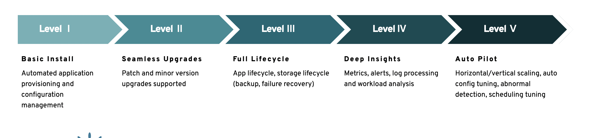

## CloudNative-PG Operator 详解

### Operator 的能力


#### 基本能力

* 通过自定义资源`crd` 定义了四个资源对象： `Cluster`, `Pooler`， `Backup`, `BackupScheduler`
* `controller` 直接控制`Pod`资源， 能更灵活的创建和调度pg实例
* 独立的实例管理器： Operator 不依赖外部工具(例如`Patroni`) 来协调集群实例，而是将`operator`可执行文件注入每个pod内(通过`initdb`阶段)，该应用程序用于控制底层的`PostgreSQL`, 并根据PostgreSQL 集群拓扑来协调Pod状态。
* 支持配置不同存储， 并内置`cnp-bench` 开源项目， 可用于在生产前对存储和数据库进行基准测试
* 副本配置， 当replicas=1 时， 集群仅包含一个没有副本的主`PostgreSQL`实例， 如果replicas>1 这，operator将管理1主(replicas-1)从的集群， 包括自动故障转移实现高可用， 以及通过主从切换等操作进行滚动更新
* db角色配置： 支持在自定义资源中， 通过声明式配置来管理PostgreSQL 角色， 用户和组等`.spec.managed.roles`
* 提供`cnpg`插件 来管理CloudNative-pg 集群

#### 无缝更新

* Operator支持滚动更新和原地更新(`InPlace`)

* 工作负载的升级
  在存在`standby`实例的情况下， 集群更新从副本开始。 它通过删除现有的`Pod`并创建一个新的`Pod`， 使用新的operatorImage, 同时重用底层存储(`PVC`)来实现， 根据`primaryUpdateStrategy`, Operator在更新先前的主节点之前执行切换； 或者集群可以等待用户通过`kubectl cnpg`手动发起切换过程。

#### 自定义的控制器
cloudnative-pg 使用自定义的控制器直接管理pod资源：
* 主实例与副本实例
* PVC 的一致性
* 扩展的灵活性 （sidecar 镜像更新/ InPlacePodVerticalScaling 特性的支持等）

#### 灾难恢复 
* 如果发生故障的 pod 是standby pod,则将该 pod 从 -r服务中删除并从-ro服务中删除。然后使用其 PVC(如果可用) 重新启动 Pod;否则,将从当前主 Pod的备份创建一个新 Pod。pod 将再次添加到 -r 服务中，并-ro在准备好后添加到服务中。
* 如果发生故障的 Pod 是主 Pod,operator将提升状态为*就绪且复制延迟最低*的active Pod,然后将service `-rw`关联新主pod，并将其从 service `-r`中删除， 原主从 `-rw` service中删除。其他备用数据库将开始从新的主数据库进行复制。如果前一个主节点的PVC可用，则原主节点将使用`pg_rewind`与新主节点同步;否则，将从当前主数据库的备份创建一个新的备用数据库

#### 自动故障转移
在出现上述情况后，主 Pod 的就绪探针将开始失败。这将在控制器的协调循环中被拾取。控制器将分两步启动故障转移过程：

1. 首先，它将标记TargetPrimary为pending。此状态更改将强制主 Pod 关闭，以确保副本上的 WAL 接收器停止。集群将被标记为处于故障转移阶段（“failover”）。
2. 一旦所有 WAL 接收器停止，就开始主备切换。所选实例将启动升级为主实例，完成后，集群将恢复正常运行。同时，原来的主 Pod 会重新启动，检测到它不再是主节点，并成为副本节点（pg_rewind）。

RTO 和 RPO 影响
* 故障转移可能会导致服务受到影响和/或数据丢失：
* 在主服务器开始出现故障期间，以及在控制器启动故障转移过程之前，传输中的查询、WAL 写入、检查点和类似操作可能会失败。
* 一旦发出快速关闭命令，集群将不再接受连接，因此服务会受到影响，但不会丢失数据。
* 如果快速关闭失败，立即关闭将停止任何挂起的进程，包括 WAL 写入。数据可能会丢失。
* 在主数据库关闭且新的主数据库尚未启动期间，集群将在没有主数据库的情况下运行，从而受到损害 - 但不会丢失数据。
#### 通过同步复制实现零数据丢失集群

  Operator 提供两个配置选项，用于控制任何时间可用的预期同步备用副本的最小和最大数量， 计算公式

  ```shell
  1 <= minSyncReplicas <= q <= maxSyncReplicas <= readyReplicas
  ```
#### 完整生命周期管理
* `Fencing` 机制
​	`Fencing` 是postgres集群在一个或多个实例出现故障时的一种保护措施， 当设定某个实例`fencing`时， 该实例的postgres进程一定会被关闭， 当pod还保持运行，这可以确保`fencing`状态关闭前， 该实例的数据不会被修改，在此期间， 可以通过进入pod对文件系统进行调试和故障排除

* 基于`prometheus` 提供的自定义资源， 提供可观测的监控指标， 由`controller` 提供， 而不需要另起`sidecar` pod 来实现
* paAudit. 在审计方面， 集成了pg_audit 工具
* pg wal 日志的存档


PostgreSQL备份

可以使用Kubernetes CSI 支持的卷快照(VolumeSnapshot) 以及对象存储(通过`barman`实现)

支持按需备份和定时备份等操作， `Backup`/`ScheduleBackup`
* 支持从`standby`实例备份
* 从备份完全恢复
* 从备份进行时间点恢复(PITR)
* 通过同步复制实现零数据丢失集群

#### 调度
* 节点亲和性/反亲和性
* 节点选择器
* 污点容忍度
#### 实例管理器

如果检测到主节点故障，`Operator`将通过设置最符合(most aligned)的副本为新的目标主节点来更改集群状态。因此，每个存活的 pod 中的实例管理器会启动必要的程序以使自身与集群状态的变化保持一致。它可以通过成为新的主节点或者跟随主节点来实现这一点。如果之前的主节点重新启动，同样的机制会防止出现脑裂（split-brain）的情况，方法是阻止应用程序访问该集群，运行 pg_rewind 来重置服务器，并将其重新启动为备用节点。

#### 通过PodDisruptionBudget支持服务的持续可用性
创建一种PodDisruptionBudget资源来限制一个主实例的并发中断数量。此配置可防止维护操作删除集群中的所有 Pod，从而允许创建指定数量的实例； 通过指定`maxUnavailable` 来限定最大不可用pod数

#### CNPG 插件功能

```shell
A plugin to manage your CloudNativePG clusters

Usage:
  kubectl-cnpg [command]

Available Commands:
  backup      Request an on-demand backup for a PostgreSQL Cluster
  certificate Create a client certificate to connect to PostgreSQL using TLS and Certificate authentication
  completion  Generate the autocompletion script for the specified shell
  destroy     Destroy the instance named [CLUSTER_NAME] and [INSTANCE_ID] with the associated PVC
  fencing     Fencing related commands
  fio         Creates a fio deployment,pvc and configmap.
  help        Help about any command
  hibernate   Hibernation related commands
  install     CNPG installation commands
  logs        Collect cluster logs
  maintenance Sets or removes maintenance mode from clusters
  pgbench     Creates a pgbench job
  promote     Promote the pod named [cluster]-[node] or [node] to primary
  psql        Start a psql session targeting a CloudNativePG cluster
  reload      Reload the cluster
  report      Report on the operator
  restart     Restart a cluster or a single instance in a cluster
  snapshot    command removed
  status      Get the status of a PostgreSQL cluster
  version     Prints version, commit sha and date of the build
```

#### 记录在cluster资源中的状态
```yaml
status:
  certificates:
    clientCASecret: cluster-example-ca
    expirations:
      cluster-example-ca: 2024-03-26 09:01:19 +0000 UTC
      cluster-example-replication: 2024-03-26 09:01:19 +0000 UTC
      cluster-example-server: 2024-03-26 09:01:19 +0000 UTC
    replicationTLSSecret: cluster-example-replication
    serverAltDNSNames:
    - cluster-example-rw
    - cluster-example-rw.default
    - cluster-example-rw.default.svc
    - cluster-example-r
    - cluster-example-r.default
    - cluster-example-r.default.svc
    - cluster-example-ro
    - cluster-example-ro.default
    - cluster-example-ro.default.svc
    serverCASecret: cluster-example-ca
    serverTLSSecret: cluster-example-server
  cloudNativePGCommitHash: 9bc5b9b2
  cloudNativePGOperatorHash: a2c8631b95be2d8fe8599c7ad8bdc1ab5fcfc6041ebba92cef3173dc1b1d0f4d
  conditions:
  - lastTransitionTime: "2024-01-02T02:21:54Z"
    message: Cluster is Ready
    reason: ClusterIsReady
    status: "True"
    type: Ready
  - lastTransitionTime: "2023-12-27T09:17:43Z"
    message: Continuous archiving is working
    reason: ContinuousArchivingSuccess
    status: "True"
    type: ContinuousArchiving
  configMapResourceVersion:
    metrics:
      cnpg-default-monitoring: "3285"
  currentPrimary: cluster-example-1
  currentPrimaryTimestamp: "2023-12-27T09:07:13.830318Z"
  healthyPVC:
  - cluster-example-1
  - cluster-example-3
  - cluster-example-4
  instanceNames:
  - cluster-example-1
  - cluster-example-3
  - cluster-example-4
  instances: 3
  instancesReportedState:
    cluster-example-1:
      isPrimary: true
      timeLineID: 1
    cluster-example-3:
      isPrimary: false
      timeLineID: 1
    cluster-example-4:
      isPrimary: false
      timeLineID: 1
  instancesStatus:
    healthy:
    - cluster-example-1
    - cluster-example-3
    - cluster-example-4
  latestGeneratedNode: 4
  managedRolesStatus: {}
  onlineUpdateEnabled: true
  phase: Cluster in healthy state
  poolerIntegrations:
    pgBouncerIntegration: {}
  pvcCount: 3
  readService: cluster-example-r
  readyInstances: 3
  secretsResourceVersion:
    applicationSecretVersion: "1891"
    clientCaSecretVersion: "1887"
    replicationSecretVersion: "1889"
    serverCaSecretVersion: "1887"
    serverSecretVersion: "1888"
    superuserSecretVersion: "1890"
  targetPrimary: cluster-example-1
  targetPrimaryTimestamp: "2023-12-27T09:06:19.794583Z"
  timelineID: 1
  topology:
    instances:
      cluster-example-1: {}
      cluster-example-3: {}
      cluster-example-4: {}
    nodesUsed: 1
    successfullyExtracted: true
  writeService: cluster-example-rw
```

